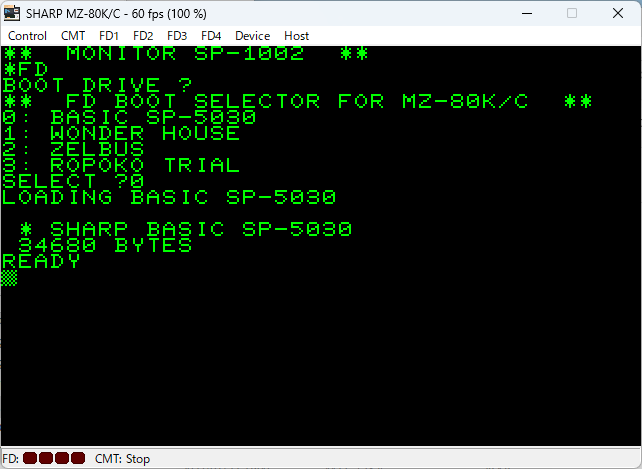

# FD BOOT selector for MZ-80K/C

## 概要

MZ-80K/C 用の FD ブートセレクタです。
FD の IPL 領域に書き込んでおくことで、FD 内の任意のファイルを起動できるようになります。

SP-6010, SP-6110 の両方のディスクフォーマットに対応しています。

## 必要なもの

* [EmuZ-80K](http://takeda-toshiya.my.coocan.jp/mz80k/index.html) エミュレータ
  * FD起動のために、FDIF.ROM (MZ-80FIO Boot ROM) が必要です。
* [MZDiskExplorer](https://daimonsoft.info/argo/download.html)
  * ディスクイメージの操作のために必要です。

ソースコードからのビルドには、[zasm](https://k1.spdns.de/Develop/Projects/zasm/Documentation/) が必要です。

## 使い方

### ディスクイメージの作成

1. MZDiskExplorer を起動します。
2. ファイル(F) → 新規作成(N) で新規ディスクイメージを作成します。
    * 「ディスクの種類」は "MZ-80K 2S (SP-6010)" か "MZ-80K 2S (SP-6110)" のいずれかを選択します。
3. 新規イメージを作成したら、編集(E) → ブートプログラム登録 を選択し、本プログラム [fdbootsel.bin](fdbootsel.bin) を登録します。
    * 選択するメニューは「システムプログラム登録(MZ-80Kのみ)」の方ではないので注意してください。
    * 「ブートプログラム登録」のダイアログが出ますが、MZ-80K では入力項目には意味がないのでそのまま OK を押してください。
4. 編集(E) → ファイル追加 などで、ディスクイメージに登録したいファイルを追加します。
5. ファイル(F) → 上書き保存(S) などで、作成したディスクイメージを保存します。

### 起動

1. EmuZ-80K を起動し、作成したディスクイメージをセットします。
2. SP-1002 上から FD コマンドを実行し、ディスクイメージを起動します。
3. ディスク上にある OBJ ファイルの一覧が 0～Z で表示されるので、起動したいファイルを選択します。

## 謝辞

開発には以下のページを参考にさせていただきました。ありがとうございます。

* アルゴの記憶 (by kuran_kuran氏) から
  * [MZ-80KのSP-6010タイプディスクについて](https://daimonsoft.info/argo/mz80kdisk.html) 
  * [MZ-80KのSP-6110タイプディスクについて](https://daimonsoft.info/argo/mz80k-sp6110disk.html)
* Enri's Home pageから
  * [mz-80K SP-1002](http://cmpslv2.starfree.jp/Mz80k/Mzsp.htm)
  * [mz-80K FD](http://cmpslv2.starfree.jp/Mz80k/Mz80fd.htm)

## ライセンス

* MIT License
